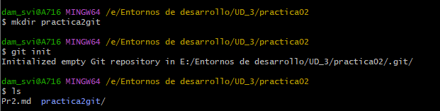

# Practica 2 - GIT
# Practica 2 - GIT
#### Isaac Sánchez Vilches - Entornos de desarrollo 23/24
###### Usuario en Github: Isanvil
###### Enlace: https://github.com/Isanvil/UD3Pr2.git
----


1. Cread un repositorio (directorio) llamado practica2git e inicializa el sistema de control de versiones  

  

2. Cread un fichero llamado contenido.txt con el siguiente texto:
```
- Introducción a linea de comandos
    - Windows
    - Linux
```

  

3. Comprobad el estado del repositorio  

  

4. Añadid el fichero a la zona de preparado  

  

5. Comprobad de nuevo el estado del repositorio  

  

6. Haced el primer commit con su comentario correspondiente  

  

7. Añadid la línea al fichero:
```
- Mac
``` 
  

8. Compruebad de nuevo el estado del repositorio  

  

9. Añadid el fichero a preparado  

  

10. Haced otro commit del fichero  

  

11. Cambiad el mensaje del último commit por “Añadido la línea de MAC.”
```
Para cambiar el mensaje del commit se usa:

$git commit --amend -m "Mensaje"
```  

